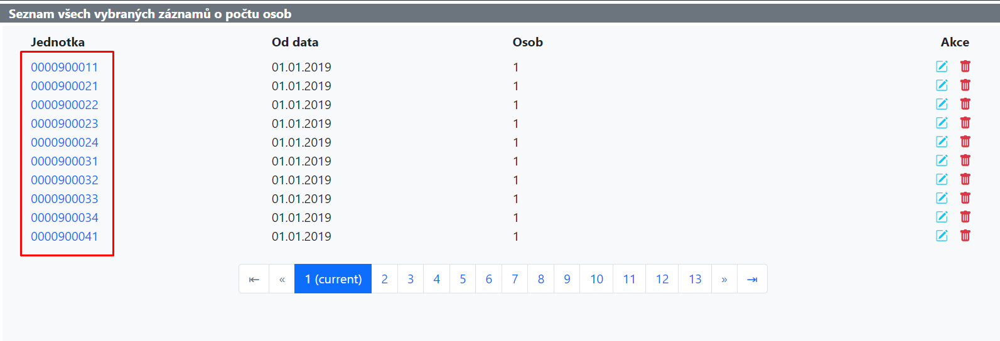

An **inline menu** is a colection of links, typically renered as icon buttons. These can be found in pretty much every listing page throughout the application.

Every object, with exceptions of course, has a **detail**, **update** and **delete** views associated with them. For that reason there are usually three icons (inline menu items) for each object in a listing page (as can be observed on the image below).



As of the time of writing this (September 2024), the `inline_menu_item.py` defines the following three template tags:

### Inline Menu Icon

The most widely used tag for inline menu items. The link is rendered as an icon for a better UX experience.

```Python title="Function signature"
def inline_menu_icon(icon_type, url_address, tooltip=None, **kwargs):
    ...
```

The only mandatory parameters are the `url_address` and `icon_type`.

`url_address`
:   A reversible view name.

    As the function accepts kwargs, **query parameters** can be passed in as regular kwargs (i.e. `query_param=value`).

    As for **path parameters**, they just need a prefix of `get_` (i.e. `get_path_param=value`).

`icon_type`
:   The type of icon to render. Right now, there is no way to define a custom icon while defining the menu item, only the icons in the following table are supported. If an unsupported icon is passed in, the default icon is rendered instead.

| Icon Name     | Bootstrap Icon Class              | Color                                                                    | Label       |
|---------------|-----------------------------------|--------------------------------------------------------------------------|-------------|
| detail        | `bi bi-info-lg`                   | `DEFAULT_APPLICATION_BUTTONS_LINKS_CONFIGURATION['link_color_normal']`   | Detail      |
| create        | `bi bi-folder-plus`               | `DEFAULT_APPLICATION_BUTTONS_LINKS_CONFIGURATION['link_color_success']`  | Vytvořit    |
| update        | `bi bi-pencil-square`             | `text-info`                                                              | Upravit     |
| delete        | `bi bi-trash-fill`                | `DEFAULT_APPLICATION_BUTTONS_LINKS_CONFIGURATION['link_color_danger']`   | Vymazat     |
| disconnect    | `bi bi-ban`                       | `DEFAULT_APPLICATION_BUTTONS_LINKS_CONFIGURATION['link_color_danger']`   | Odpojit     |
| copy          | `bi bi-journals`                  | `text-warning`                                                           | Kopírovat   |
| paste         | `bi bi-clipboard2-check-fill`     | `DEFAULT_APPLICATION_BUTTONS_LINKS_CONFIGURATION['link_color_success']`  | Vložit      |
| activate      | `bi bi-play-circle-fill`          | `DEFAULT_APPLICATION_BUTTONS_LINKS_CONFIGURATION['link_color_success']`  | Aktivovat   |
| connect       | `bi bi-paperclip`                 | `DEFAULT_APPLICATION_BUTTONS_LINKS_CONFIGURATION['link_color_success']`  | Připojit    |
| range         | `bi bi-arrows-expand-vertical`    | `DEFAULT_APPLICATION_BUTTONS_LINKS_CONFIGURATION['link_color_success']`  | Rozsah      |
| default       | `bi bi-question-circle-fill`      | `DEFAULT_APPLICATION_BUTTONS_LINKS_CONFIGURATION['link_color_danger']`   | Invalid icon|
| add           | `bi bi-plus-circle`               | `DEFAULT_APPLICATION_BUTTONS_LINKS_CONFIGURATION['link_color_normal']`   | Přidat      |
| configuration | `bi bi-gear`                      | `DEFAULT_APPLICATION_BUTTONS_LINKS_CONFIGURATION['link_color_success']`  | Konfigurace |
| competency    | `bi bi-key`                       | `DEFAULT_APPLICATION_BUTTONS_LINKS_CONFIGURATION['link_color_danger']`   | Oprávnění   |

`tooltip`
:   An optional tooltip that is shown when the user hovers over the icon. If no tooltip is defined, the label from the table above is used as the tooltip.

```HTML title="Examples"
# Blue update icon (bi bi-pencil-square) with the link /accounts/createconfiguration/?user_id=16


# Blue update icon (bi bi-pencil-square) with the link /accounts/editprofile/16/ 



# Dark blue detail icon (bi bi-info-lg) with the link /najemnijednotky/bytydetail/1/ 


# Blue update icon (bi bi-pencil-square) with the link /najemnijednotky/bytyupdate/1/?sourcecaller=L&referraldumid=1


# Red delete icon (bi bi-trash-fill) with the link /najemnijednotky/bytydelete/1/?sourcecaller=L&referraldumid=1

```