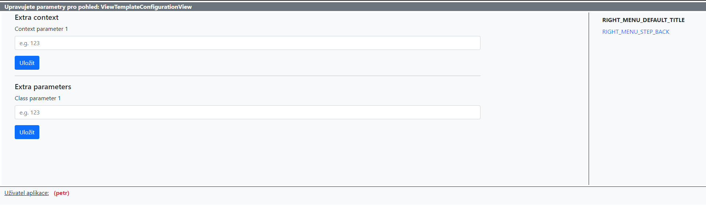

## The idea

The idea behind the `DatabaseConfigurableTemplateMixin` is to have an option to modify the context, class parameters and then some for a given view directly from the database.

Views that extend the `DjangoPuzzleMixinWrapper` already extend the `DatabaseConfigurableTemplateMixin` as so all the developer needs is assign an id to the view like so:

```Python
class MyView(DatabaseConfigurableTemplateMixin):
    view_id = 'my-class' # 30chars length restriction
```

## The model

The configuration for each view is stored in the database using the following `ViewTemplateConfiguration` view.

```Python
class ViewTemplateConfiguration(models.Model):
    # Display name for easier orientation
    view_name = models.CharField(max_length=50)
    # View ID - serves as some kind of "ForeignKey" to connect View with its DB configuration
    view_id = models.CharField(max_length=30)
    # Template name
    template_name = models.CharField(max_length=150, null=True, blank=True)
    # This dictionary is added as is into View.other_context parameter_name (append operation)
    extra_context = models.JSONField(default=dict, null=True, blank=True)
    # Attributes used inside of View class instance as its own class->parameter_name.paramXYname
    # used in behaviour modification for example
    extra_parameters = models.JSONField(default=dict, null=True, blank=True)
```

As we can see, we can alter the view's **context**, **class parameters** and the **template**.

## Front-end

The database record can of course be manually modified from the admin interface. Occasionally though, the users themselves need to be able to modify a view's context for whatever reason. This is where the context configuration view comes in.

The configuration view can be accessed at `/common/configure-context/`. It expects an app name and a view name separated by a colon (**:**) - the same the `reverse()` function is used (i.e. `reverse('app:view_name')`).

!!! example "Accessing a configuration view"
    We have a view defined in `urls.py` like so:
    ```Python title="urls.py"
    app_name = 'byty'
    path('sestavabytyvlastnici/', SestavaBytyVlastnici.as_view(), name='sestava-byty-vlastnici')
    ```
    The URL to the configuration view for this particular view will be `/common/configure-context/byty:sestava-byty-vlastnici'`.

### Requirements

In order for a view to take advantage of the configuration view it has to conform to the "standard".

- The view must extend the `DatabaseConfigurableTemplateMixin`
- A `view_id` property must be specified (so the view can be linked to a database record)
- A `user_configurables` property must be specified (so the view knows which parameters to make available for users to modify)

### User configurables

We might not want to give acccess to all the view parameters but just a subset, that's where the `user_configurables` property comes in.

```Python
class MyView(DatabaseConfigurableTemplateMixin):
    view_id = 'my_view'
    user_configurables = {
        'extra_context': [
            {
                'name': 'context1',
                'label': 'Context parameter 1',
                'placeholder': 'e.g. 123'
            }
        ],
        'extra_parameters': [
            {
                'name': 'param1',
                'label': 'Class parameter 1',
                'placeholder': 'e.g. 123'
            }
        ]
    }
```

This dictionary pretty much describes what the configuration form will look like (as per the following image). 



Note that the `name` values will be used as keys in the database - a context parameter defined here will be available in the global context in a template under the same name.