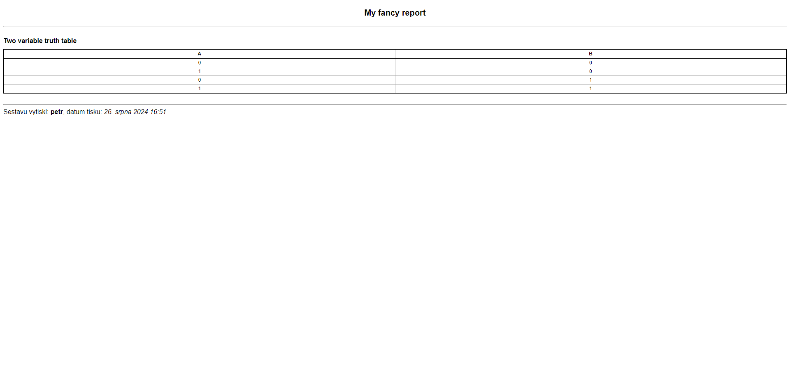

A report is just like any other view in Django. We understandably have to use CBV as the whole report system is built with the approach in mind.

First things first, let's create our view and extend the `ReportView` class.

```Python title="Create view"
class MyReportView(ReportView):
    pass
```

When we open our view we get an `ImproperlyConfigured` exception saying *ReportMixin requires either a definition of 'report_headline' or an implementation of 'get_report_headline()'*. So we have to define our report headline.

```Python title="Define headline"
class MyReportView(ReportView):
    headline = 'My fancy report'
    tables = [] # So we can see the complete barebones report
```


At this stage, our report isn't very useful. Before we get into building tables, we need to familiarize ourselves with the basic building blocks.

## Creating our first table

Let's say we want to create a two variable truth table. A table with two columns for the two variables would look like this:

```Python title="Table instantiation"
ReportTable(('A', 'B'), heading="Two variable truth table")
```

At this point, we could add this table instance into the table list in our report, but we would only get the table header (the first row), because we haven't actually added any data to it yet.

We have two options when it comes to adding rows, an implicit function (`add_row_impl()`) and an explicit function (`add_row_expl()`).

`add_row_impl()`

:   This function takes in an arbitrary number of cells.

`add_row_expl()`

:   This function expects an instance of `ReportTableRow`.

```Python
class MyReportView(ReportView):
    headline = 'My fancy report'

    def get_tables(self):
        truth_table = ReportTable(('A', 'B'), heading="Two variable truth table")

        truth_table.add_row_impl(ReportTableCell('0'), ReportTableCell('0'))
        truth_table.add_row_impl(ReportTableCell('1'), ReportTableCell('0'))
        truth_table.add_row_impl(ReportTableCell('0'), ReportTableCell('1'))
        truth_table.add_row_impl(ReportTableCell('1'), ReportTableCell('1'))

        return [truth_table]
```

