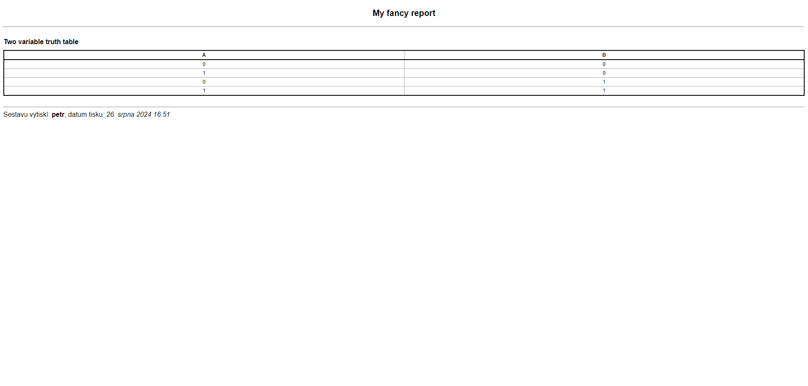
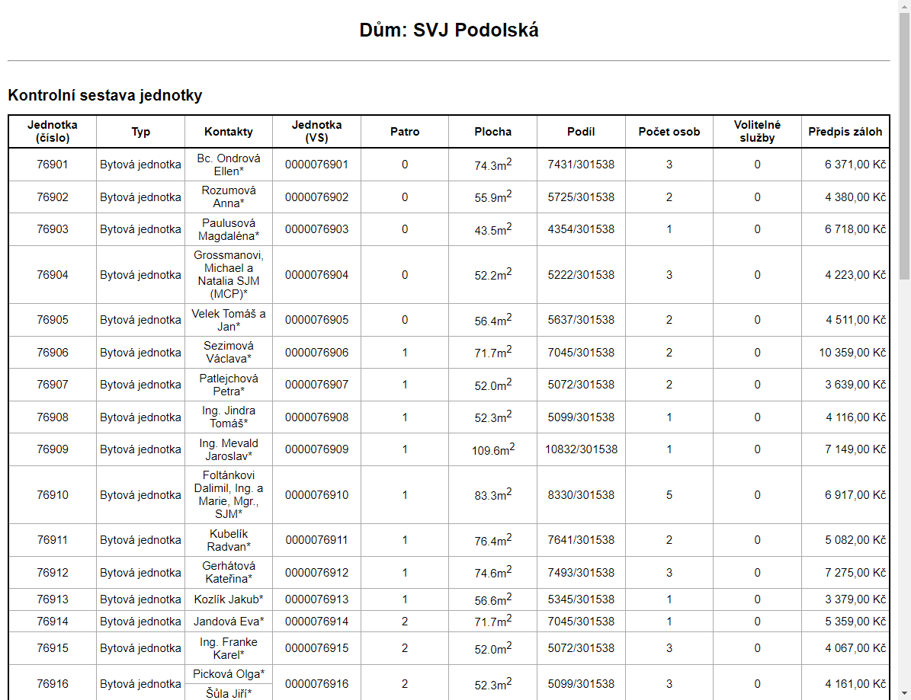
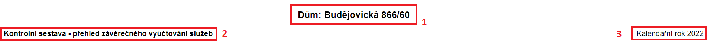
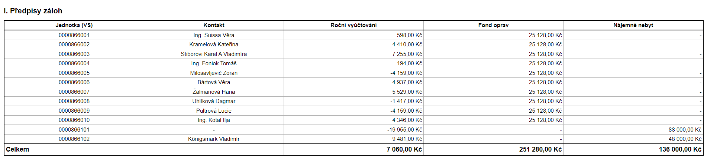
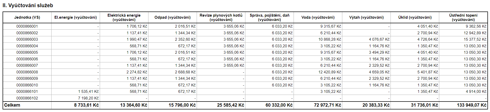
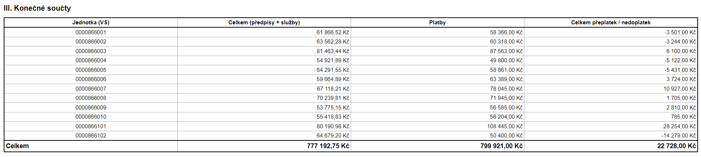
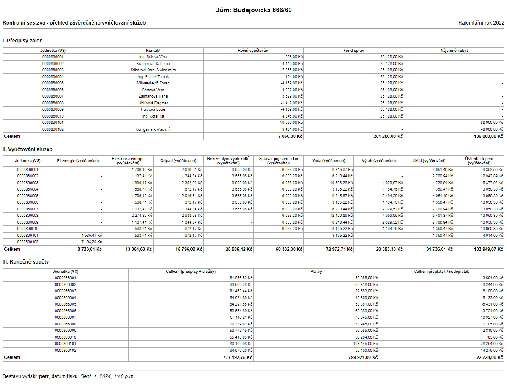

A report is just like any other view in Django. We understandably have to use CBV as the whole report system is built with the approach in mind.

First things first, let's create our view and extend the `ReportView` class.

```Python title="Create view"
class MyReportView(ReportView):
    pass
```

When we open our view we get an `ImproperlyConfigured` exception saying *ReportMixin requires either a definition of 'report_headline' or an implementation of 'get_report_headline()'*. So we have to define our report headline.

```Python title="Define headline"
class MyReportView(ReportView):
    headline = 'My fancy report'
    tables = [] # So we can see the complete barebones report
```


At this stage, our report isn't very useful. Before we get into building tables, we need to familiarize ourselves with the basic building blocks.

## Creating our first table

Let's say we want to create a two variable truth table. A table with two columns for the two variables would look like this:

```Python title="Table instantiation"
ReportTable(('A', 'B'), heading="Two variable truth table")
```

At this point, we could add this table instance into the table list in our report, but we would only get the table header (the first row), because we haven't actually added any data to it yet.

We have two options when it comes to adding rows, an implicit function (`add_row_impl()`) and an explicit function (`add_row_expl()`). If not enough cells in a row is provided to match the number of columns, empty cells are rendered in instead.

`add_row_impl()`

:   This function takes in an arbitrary number of cells.

`add_row_expl()`

:   This function expects an instance of `ReportTableRow`.

```Python
class MyReportView(ReportView):
    headline = 'My fancy report'

    def get_tables(self):
        truth_table = ReportTable(('A', 'B'), heading="Two variable truth table")

        truth_table.add_row_impl(ReportTableCell('0'), ReportTableCell('0'))
        truth_table.add_row_impl(ReportTableCell('1'), ReportTableCell('0'))
        truth_table.add_row_impl(ReportTableCell('0'), ReportTableCell('1'))
        truth_table.add_row_impl(ReportTableCell('1'), ReportTableCell('1'))

        return [truth_table]
```


## Production example 1

So that we can understand the system more, let's make reports that are already built and in production. This report will consist of a singular table where each row represents a single '*jednotka*' and each column an important property of each instance.

The columns required are the following:

- Číslo jednotky
- Typ
- Kontakty
- Variabilní symbol jednotky
- Patro
- Plocha (v m<sup>2</sup>)
- Podíl
- Počet osob
- Volitelné služby
- Předpis záloh

```Python
class SestavaByty(DumReportView): # (1)!
    title = 'Sestava jednotky' # (2)!

    def get_tables(self):
        table = ReportTable((
            'Jednotka<br>(číslo)', 'Typ', 'Kontakty', 'Jednotka<br>(VS)', 'Patro', 'Plocha', 'Podíl', 'Počet osob',
            'Volitelné služby', 'Předpis záloh'
        ), 'Kontrolní sestava jednotky') # (3)!

        for jednotka in Byty.objects.vyber_dum(self.get_referral_dum()): # (4)!
            table.add_row_impl(
                ReportTableCell(jednotka.cislo),
                ChoiceCell(jednotka.typ_jednotky, TypyJednotek), # (5)!
                ReportTableCell([
                    (
                        f'{contact.kontakt}*' if isinstance(jednotka.seznam_kontaktu_report, VlastniciQuerySet)
                        else contact.kontakt
                    )
                    for contact in jednotka.seznam_kontaktu_report
                ]), # (6)!
                ReportTableCell(jednotka.variabilni),
                ReportTableCell(jednotka.patro),
                ReportTableCell(f'{jednotka.rozloha}m<sup>2</sup>'),
                ReportTableCell(jednotka.velikost_podilu_zlomek),
                ReportTableCell(jednotka.pocet_osob),
                ReportTableCell(jednotka.pocet_volitelnych_sluzeb),
                CurrencyCell(secti_platne_definice_zaloh_byt(jednotka))
            )

        return [table]
```

1. We're using the extended version of the base `ReportView`, because it has convenient features tailored to reports that have anything to do with '*Domy*' of '*Byty*'.
2. Setting the page title to '*Sestava jednotky*'.
3. Report table instantiation. Passing in a tuple of column names and a table heading.
4. Iterating over all the *jednotky* and adding a row to the table for each one.
5. Property `jednotka.typ_jednotky` returns either 'A' or 'B'. The `TypyJednotek` is a mapping of these two values to their corresponding names. Instead of using the generic `ReportTableCell` and an if statement, we use the `ChoiceCell` that is designed for this purpose.
6. The `seznam_kontaktu_report` property returns either a `VlastniciQuerySet` or `NajemniciQuerySet`. A contact that is a '*Vlastnik*' needs to have a asterisk attached.



## Production example 2

Let's now take a much more complex report. In this example, we will look at the '*Závěrečné vyúčtování služeb*'. 

It consists of an extra header content, a custom table renderer and **three** tables.

The individual tables are in their separate classes as not to introduce too much clutter in the `views.py` files.

```Python
class SestavaZaverecneVyuctovaniSluzeb(DumReportView):
    title = 'Závěrečné vyúčtování služeb'
    extra_header = TemplateContent(
        'snippets/report_kontrolni_sestava_period_extra_header.html',
        sestava='přehled závěrečného vyúčtování služeb'
    ) # (1)!
    report_renderer = 'snippets/zaverecne_vyuctovani_sluzeb_report_renderer.html' # (2)!

    def get_tables(self):
        tables = []

        # Tabulka I.
        predpisy_zaloh_table = PrehledZaverecnehoVyuctovaniSluzeb(self.referral_dum, self.vybrany_rok)

        # Tabulka II.
        vyuctovani_sluzeb_table = DetailniVyuctovaniSluzeb(self.referral_dum, self.vybrany_rok)

        # Tabulka III.
        summary_table = KonecneSouctySluzeb(self.referral_dum, self.vybrany_rok, predpisy_zaloh_table.jednotky_totals)

        tables.extend([predpisy_zaloh_table, vyuctovani_sluzeb_table, summary_table])
        return tables
```

1. A common header extracted into a template extra content. Discussed in a following [section](#extra-content).
2. A custom renderer used to insert a print-only page break after every table. The renderer code itself can be seen in a codeblock below.

The custom renderer, as mentioned, adds a print-only page break after every table, so that the printed report has each paper dedicated to every table.

```HTML title="snippets/zaverecne_vyuctovani_sluzeb_report_renderer.html"


    {{ block.super }}
    
        <div class="print-page-break"></div>
    

```

### Extra content

The view takes advantage of the `extra_header` property. The `TemplateContent` is used with the template `report_kontrolni_sestava_period_extra_header.html`.

The report header is captured on the image below. 

The report title (labeled with a **1**) is handled by the `DumReportView`. It is aware of what '*Dum*' we are dealing with and using that information it dynamically creates the report title.

The extra content template gets passed a `sestava` parameter (used in the title labeled with a **2**) and already has access to the year of the report (labeled with a **3**) so using this extra content saves on repeating code.



### Individual tables

In this section, the source code for the three tables is shown and described. Only the main construction part of the class is shown, because there is no need to show setting the columns, titles, etc.

```Python title="PrehledZaverecnehoVyuctovaniSluzeb"
for jednotka in self.aktivni_jednotky(date(self._year, 12, 31)):
    sluzby = []
    for category in self._categories: # (1)!
        amount = get_kategorie_zalohy_castka(jednotka, category, self._year)
        sluzby.append(CurrencyCell(amount))
        self.totals[list(self._categories).index(category)] += amount if amount is not None else 0

    self.add_row_impl(
        ReportTableCell(jednotka.variabilni),
        ReportTableCell(jednotka.primarni_kontakt),
        *sluzby # (2)!
    )

self.add_row_expl(ReportTableRow.total_table_sum_row(
    EmptyCell(), *[CurrencyCell.sum_cell(total) for total in self.totals]
)) # (3)!
```

1. Compiling the categories.
2. Adding the cells. Every '*jednotka*' may have a different amount of cells so there might be empty cells in some columns.
3. Adding a final summation row. Displays the totals of all the rows summed up.



```Python title="DetailniVyuctovaniSluzeb"
totals = {index: 0 for index, sluzba in enumerate(self.sluzby_domu_mimo_fo)} # (1)!

for jednotka in self.aktivni_jednotky(date(self.year, 12, 31)):
    def handle_sluzba(sluzba, index):
        suma = self.soucet_vyuctovani_sluzby_pro_jednotku(jednotka, sluzba, self.year)
        totals[index] += suma
        return suma if suma != 0 else None

    self.add_row_impl(
        ReportTableCell(jednotka.variabilni),
        *[
            CurrencyCell(handle_sluzba(sluzba_definice, index))
            for index, sluzba_definice in enumerate(self.sluzby_domu_mimo_fo)
        ] # (2)!
    )
self.add_row_expl(ReportTableRow.total_table_sum_row(
    *(CurrencyCell.sum_cell(total) for total in totals.values())
)) # (3)!
```

1. A dictionary to keep track of totals of '*služby*' to later display in the last summation row.
2. The table has a variable amount of columns depending on what sluzby the '*Dum*' has.
3. Adding a final summation row. Displays the totals of all the rows summed up.



```Python title="KonecneSouctySluzeb"
predpisy_total = 0
platby_total = 0
celkem_total = 0
for jednotka in self.aktivni_jednotky(date(self.year, 12, 31)):
    sluzby_bez_fo = self.soucet_vyuctovani_sluzeb_pro_jednotku(
        jednotka, self.sluzby_domy_mimo_fo(), self.year
    )

    predpisy = sluzby_bez_fo + self.jednotky_totals[jednotka.variabilni]
    platby = self.jednotka_zaplaceno_na_zalohach(jednotka, self.year)
    celkem = round(platby - predpisy)

    self.add_row_impl(
        ReportTableCell(jednotka.variabilni),
        CurrencyCell(predpisy),
        CurrencyCell(platby),
        CurrencyCell(celkem)
    )
    predpisy_total += predpisy
    platby_total += platby
    celkem_total += celkem

self.add_row_expl(ReportTableRow.total_table_sum_row(
    CurrencyCell.sum_cell(predpisy_total),
    CurrencyCell.sum_cell(platby_total),
    CurrencyCell.sum_cell(celkem_total)
)) # (1)!
```

1. Adding a final summation row. Displays the totals of all the rows summed up.



The final report looks like this:

