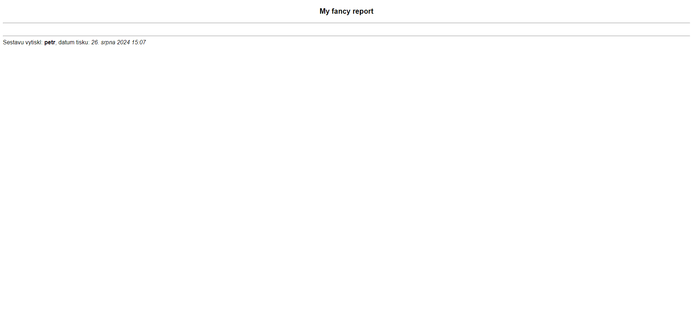

At the heart of every report lies the `ReportView` class. At the high level, it facilitates putting the whole report together (so not just inidividual tables). It defines how everything is layed out, what the page title and headline are. It also takes care of extra content. Holds a reference to the table renderer template so it can indirectly affect what individual tables look like.

The class has the following definition (only properties are show, function implementations are irrelevant):

```Python title="ReportView class properties"
class ReportView(LoginRequiredMixin,
                 GetPostParametersMixin,
                 TemplateView):
    table_renderer: str = 'snippets/report_table_renderer.html'
    template_name: str = 'asbd_report_base_template.html'
    title: str = 'Sestava'
    tables = []
    headline = 'Nepojmenovaná sestava'

    extra_header: ExtraContent = None
    extra_footer: ExtraContent = None
```

In this state, the view will not throw any exceptions complaining that it's missing properties. The report itself generated by this class will be solely a heading with the default dividers and a footer containing a singature.

A minimal configuration:

```Python
class MyReport(ReportView):
    pass
```



It holds the following properties:

`title`

:   The title of the report page.

    Defaults to '*Sestava*'.

`headline`

:   The headline of the report page.

    Defaults to '*Nepojmenovaná sestava*'


`tables`

:   A list of `ReportTable` instances.

Each report view also needs a **template** and a **table renderer** (also just a template).

`template_name`

:   Because reports are a highly specialized feature (mainly CSS-wise), we can't use the standard base template. Instead, a dedicated report base template is used.

    Takes care of the headline, extra content, dividers, etc. and passes the list of tables to the template which renders them using a table renderer.

    ```HTML
    <!-- <html> <head> etc. -->
    <body>
    
        
            
                <div class="headline">
                    <p>{{ report_headline }}</p>
                </div>
            
        
        
    
    
        <hr>
    
    
        <br>
        
            
        
    
    
        <hr>
    
    
        
        
            
        
    
    </body>
    ```

    Multiple blocks (injection points) are available for customization:

    `header`

    :   Renders the headline and extra content.

    `content-header_divider`

    :   Divider between `header` and `main_content_data`.

        Defaults to '*&lt;hr>*'.

    `main_content_data`

    :   Includes the renderer template.

    `content-footer_divider`

    :   Divider between `main_content_data` and `footer`.

        Defaults to '*&lt;hr>*'.

    `footer`

    :   Renders the extra content and a signature.

        The footer signature snippet looks like this:

        ```HTML title="snippets/report_footer_signature.html"
        
        <footer>
            Sestavu vytiskl: <b>{{ user|user_display }}</b>, datum tisku: <i></i>
        </footer>
        ```

    Defaults to '*asbd_report_base_template.html*'.

`table_renderer`

:   As previously mentioned, it's another template. It is responsible for rendering each table.

    Can also be extended to accomodate special tables.

    Defaults to '*report_table_renderer.html*'.

    ```HTML title="report_table_renderer.html"
    
    
    
        
    
        
    
        
    
    
        
            <h4 class="table-heading">{{ table.heading }}</h4>
        
        <p class="table-info">{{ table.info|if_present }}</p>
    
    
    
        <br>
    
    
        
    
        
    
        
    
    ```

    Multiple blocks (injection points) are available for customization:

    `table_before_first` - Content to insert before the first table

    `table_before_last` - Content to insert before the last table

    `table_before_other` - Content to insert before any other table

    `table_before`

    :   Content to insert before every table.

        Renders the optional heading and info by default.

    `render` - Holds the tag call (``) to render the table.

    `table_after` - Content to insert after every table

    `table_after_first` - Content to insert after the first table

    `table_after_last` - Content to insert after the last table

    `table_after_other` - Content to insert after any other table
            

## Extending the report template

A good example of a modified report template is the `zaverecne_vyuctovani_rozklad_report_template.html`. We only needed to render the tables and nothing else.

```HTML title="zaverecne_vyuctovani_rozklad_report_template.html"





```

## Extending the table renderer

The purpose of the `zaverecne_vyuctovani_sluzeb_report_table_renderer.html` is to insert a print only page break after every table (except the last one, because the printer would just spit out an empty paper).

In this case, we couldn't have used the `table_after_other` block because the page break wouldn't be inserted after the first table. For that reason, we had to use the broader `table_after` block and manually check if the table is not the last one.

```HTML title="zaverecne_vyuctovani_sluzeb_report_table_renderer.html"


    {{ block.super }}
    
        <div class="print-page-break"></div>
    

```

## Extending the base view

The base `ReportView` may be extended to abstract out common functionality. The most common example is the `DumReportView` class, which is specifically tailored for reports that are in some way tied to a single `Dum` or `Byt`.

As far as the report system goes, the `DumReportView` just automates the process of setting a headline.

```Python title="The headline logic in the DumReportView class"
def get_report_headline(self):
    if self.referral_dum:
        return f'Dům: {self.referral_dum.display_altername_or_street_name}'
    elif self.referral_byt:
        return f'Jednotka: {self.referral_byt.name_variabilni_symbol}'
    else:
        return 'Název není k dispozici'
```

## Extra content

Every report can have extra content in the header and footer. This is what the `extra_header` and `extra_footer` properties are for.

The `ExtraContent` base class has a singular function - `render()`. It is every extending class's responsibility to implement it.

### TemplateContent

The `TemplateContent` is used to include one or more templates in the report.

```Python title="Example 1: Assigning the property directly"
class SestavaPredpisyPlatbyMesicni(DumReportView):
    title = 'Měsíční rekapitulace předpisů a plateb'
    extra_header = TemplateContent('snippets/report_kontrolni_sestava_period_extra_header.html',
                                   sestava='měsíční rekapitulace předpisů a plateb (kumulovaně)')
```

```Python title="Example 2: Using a function - dynamic context"
def get_extra_header_content(self):
    return TemplateContent(
        'snippets/report_kontrolni_sestava_period_extra_header.html',
        sestava=f'seznam odečtů měřidel pro službu {self.sluzba}'
    )
```

### StringContent

If we simply want to add text, the `StringContent` is perfect tool for the job. By default all lines suppplied are concatenated and separated by a newline character (*\n*), which is automatically translated to a *&lt;br>* tag. 

The rendered string is not marked safe by default, so a `safe` parameter needs to be set to `True`.

```Python
class MyReport(ReportView):
    extra_header = StringContent(
        'This is a string content', 
        'This is a second line',
        safe=True
    )
```
