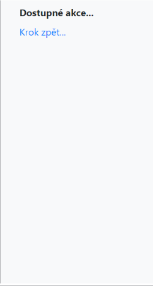

The view menu system on its own allows for a flexible way to define one or multiple menus for a given view directly from the view class.

By default, the system can handle up to three menus according to their position on the screen - left, right, bottom. For every menu there has to exist a corresponding function that returns the menu object (an instance of `ViewMenu` class).

The default function names are `get_left_menu()`, `get_right_menu()`, and `get_bottom_menu()`. The function names themselves can be changed by overriding the `menu_functions` dictionary (see below) in the `MenuMixin` class.

```Python
menu_functions = {
    'menu_right': 'get_right_menu',
    'menu_left': 'get_left_menu',
    'menu_bottom': 'get_bottom_menu'
}
```

The system looks for the previously mentioned functions in the view class and if they exist, their return values will be injected into the context under the corresponding key.

!!! example "An example"

    A view that has a left and a right menu needs to implement the `get_left_menu()` and `get_right_menu()` functions.
    As a result, the context will contain the `menu_left` and `menu_right` keys with the corresponding menu objects that can be rendered in the template.

!!! warning "Order of execution"

    The `get_context_data()` function in `MenuMixin` gets executed prior to the one in the view itself.

## Prerequisites

1) The view class must inherit from the `MenuMixin` class.

```Python title="views.py"
class MyView(MenuMixin, View):
    pass
```

2) For every menu, the view class must implement a corresponding function that returns the menu object.

The function names are defined in the `menu_functions` dictionary in the `MenuMixin` class.

```Python title="views.py"
class MyView(MenuMixin, View):
    def get_left_menu(self):
        return ViewMenu(
            ...
        )

    def get_right_menu(self):
        return ViewMenu(
            ...
        )
```

3) The menu object needs to be rendered in the template.

A custom template tag is used to render the menus.

```HTML title="template.html"

    



    

```

In case of ASBD, the `asbd_application_base_template.html` takes care of this and is also prepared to handle three menu positions.

## Defaults

The `ViewMenu` object has several defaults.

If no menu title is provided, it defaults to 'Dostupné akce...'

Furthermore, a menu is rendered using a template. The default template to be used is the `default_view_menu_template.html`. Even though a specific template can be provided, it is not necessary in most cases.

```HTML title="snippets/default_view_menu_template.html"


<!-- KONTEXTOVE ACTION MENU -->
<div class='container-fluid mb-2'>
    <!-- ZOBRAZ HLAVICKU -->
    <div class='row mt-2 mb-2'>
        <div class='col-12'>
            <b>{{ title }}</b>
        </div>
    </div>
    <!-- LINK LIST -->
    
        
            <div class='row'>
                <div class='col-12'>
                    {{ menu_item.html|safe }}
                </div>
            </div>
        
    
</div>
```

Lastly, every `ViewMenu` has a default set of items that are prepended to the menu by default. In case we wanted to omit them, we can set the `default_items` parameter to `False`. The property itself is private so it cannot be overriden, just enabled or disabled.

In the code block below we can see the `ViewMenu` default properties mentioned above.

```Python title="ViewMenu"
class ViewMenu:
    __default_menu_title = 'Dostupné akce...'
    __default_menu_template = 'snippets/default_view_menu_template.html'
    __default_items = [
        LinkMenuItem('Krok zpět...', 'javascript:window.history.back()', reversible=False),
        SpacerMenuItem()
    ]
```

The simplest menu possible is simply just an instance of the `ViewMenu` class as shown below.

```Python title="Empty menu"
def get_right_menu(self):
    return ViewMenu()
```

The code above will result in an empty menu with the defaults applied as shown in the image below.

